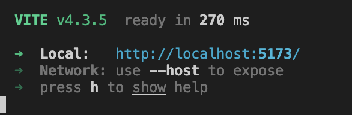

# Project Overview

## What this project is about

Briefly describe what your project is about, its purpose, and its main features.

We, knowledgeable Kiwis presents this innovative **online hackathons platform**. The term “Hackathon” is a combination of the words ‘hack’ and “marathon”. The primary purpose of hackathons is to rapidly prototype and develop new software. It brings programmers together to collaborate intensively on a project for a period of time. Participants who pariticipate in a hacakthon will focusing on solving a specifc problem or develop a new innovative solution. At the end, the host of the hackathon will select the winner and offer the prize.

## Purpose

Hackathon have been getting more and more popularity worldwide in rencent decades. Tech companies like Facebook, Google, startup and even government organiztions hosts hackathons to create innovations. As the number of hackathons continues to grow, the need for a robust online platform to revolutionize the way individuals and organizations manage and participate in these events has become increasingly clear. Existing online hackathon platforms have demonstrated several shortcomings that hinder their efficacy. For instance, users find it challenging to search for desired hackathons Additionally, these platforms often feature rigid system designs that lack customization options to suit the varying needs of different hackathons. These issues have created a demand for a more dynamic and user-friendly platform, which our project aims to address.

## Features

Our hackathon platform aims to enhance user experience and project management efficency and customizability. These include the ability to host and participate in events, manage events, register for events, make submissions, and award winners.

One of our platform's standout features is a tag system, which serves to aid in event filtering. Hackathons inherently span multiple domains, and this tag system allows both hosts and participants to align and find events that match their areas of interest more easily. Another significant feature of our platform is the customizable registration and submission forms. Recognizing that every hackathon has its unique needs and requirements, we provide the flexibility for host to design these forms. This customization feature ensures a smooth and tailored user experience for both hosts and participants.

### Upcoming features

Sign in with third-party authentication provider. Like google and github etc. Buttons are already.

Data visualizations: provide host and admin analytical data to help them better manage and improve on their existing platform or hacakthons.

# Getting Started

**!!Important!!**

Run below codes in terminals

```
git clone https://github.com/UOA-CS732-SE750-Students-2023/project-group-knowledgeable-kiwis.git
```

## Check out the master branch

```
git checkout master
```

## Install dependency

```
npm install
```

## Start the server

```
npm run dev
```

The server will run on the local **port: 5173**. Make sure it is not opccupied by other application.

# Usage

Open your modern browser, which support react and node.js .

Then copy below link and paste it in the browser. It will redirect you to the home page!

## URL:

```
http://localhost:5173/
```



As port may get changed, please check the local on your terminal as shown below

# Testing

## How to run the Test

### Run all tests

```
npm run test
```

This will run both backend and frontend test suites.

### Run backend tests only

```
npm run test:backend
```

The backend uses

1. jest
2. node test environment

### Run frontend tests only

```
npm run test:frontend
```

The frontend uses

1. Vitest
2. jsdom environment

### Run style test (Additional)

```
npm run lint
```

eslint

# Technologies Used

React

Node.js

Vite

Mui: material UI libraray

Nivo: data visualziaiton library

**Firebase**: database & backend service (replaced Express and MongoDB. Justification included in wiki).

esLint: format check

Jest: test backend

Vitest: test frontend

# Contributor

Zihan Zhong - Project manager, Back-end developer , Prototype design, Database

Ran: Front-end developer

Drason: Full stack developer

Yanjie: Front-end developer

Eason: Front-end developer

Xinya: Back-end developer

# License

Unless otherwise specified, all contributions will be licensed under MIT.

# Contributing (Reference)

<script src="https://gist.github.com/briandk/3d2e8b3ec8daf5a27a62.js"></script>
